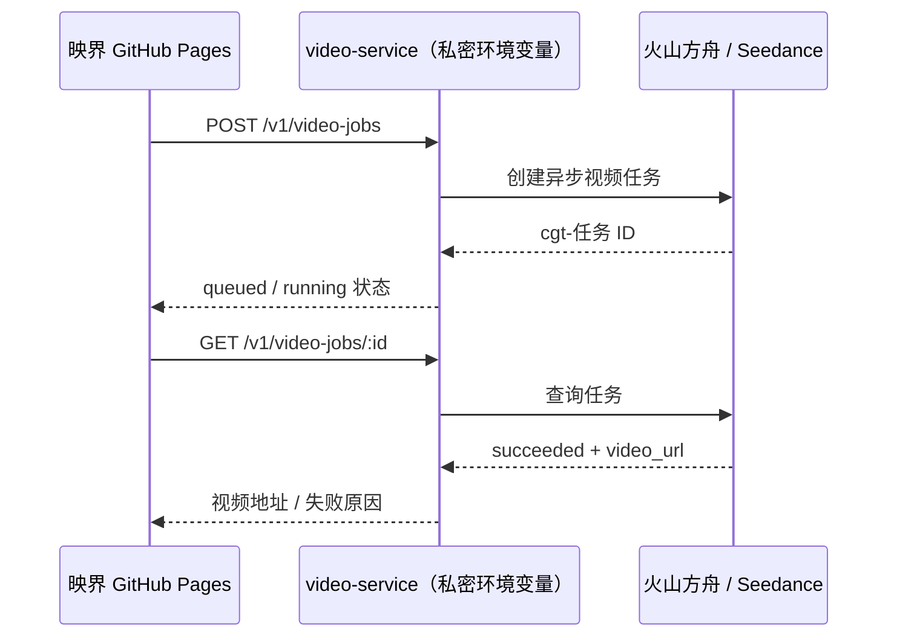

# Seedance 视频生成接入指南

映界的网页部署在 GitHub Pages，属于公开静态站点。因此 Seedance 的 API Key **绝不能**放入 `app.js`、`runtime-config.js`、GitHub Pages 环境变量或任何会被浏览器下载的文件中。本仓库通过 `video-service/` 充当唯一的服务端代理。

> 你已在对话中粘贴过密钥。为降低暴露风险，建议在完成部署后立即在火山方舟控制台轮换该密钥，并只将新密钥保存到部署平台的 Secret/Environment Variables。

## 已接入的生成链路



视频生成走火山方舟的 `POST /api/v3/contents/generations/tasks`，以 `Authorization: Bearer` API Key 鉴权；生成是异步任务，完成后经 `GET /api/v3/contents/generations/tasks/{id}` 查询。Endpoint ID 可以作为请求中的 `model`。火山方舟官方 API Explorer 列出创建、查询、删除和列表四个视频生成任务接口；其短剧最佳实践也使用同一任务地址。[视频生成 API Explorer](https://api.volcengine.com/api-explorer/?action=CreateContentsGenerationsTasks&groupName=%E8%A7%86%E9%A2%91%E7%94%9F%E6%88%90API&serviceCode=ark&version=2024-01-01) · [短剧生产参考](https://developer.volcengine.com/articles/7629571084442861606)

## 服务端配置

`video-service/.env.example` 已写入当前 Endpoint ID。复制为部署平台的环境变量，不要提交 `.env`：

```bash
ARK_API_KEY=<在部署平台 Secret 中填写>
ARK_VIDEO_ENDPOINT_ID=ep-20260712014412-l4ncj
CORS_ORIGINS=https://zeng-jm123.github.io
PORT=8787
```

本地试运行：

```bash
cd video-service
set -a; source .env; set +a
npm start
```

健康检查：

```bash
curl http://localhost:8787/healthz
```

## 发布视频网关

服务没有第三方运行时依赖，任意支持 Docker 或 Node 20 的服务都可部署。部署时把 `video-service/` 设为构建目录，使用其中的 Dockerfile，并在部署控制台填写上述三个环境变量。

部署成功后，在根目录的 `runtime-config.js` 写入网关地址：

```js
window.YINGJIE_CONFIG = {
  videoApiBaseUrl: "https://your-video-gateway.example.com"
};
```

随后推送到 GitHub Pages。前端的“使用 Seedance 生成”会创建单镜头任务、每 5 秒轮询任务状态，成功后展示返回的视频链接。

## 接口合同

### 创建单镜头任务

`POST /v1/video-jobs`

```json
{
  "prompt": "雨夜电台直播间，女主抬头望向闪烁的调音台，电影级冷暖对比，缓慢推进镜头",
  "ratio": "9:16",
  "duration": 5,
  "resolution": "720p",
  "firstFrameUrl": "https://cdn.example.com/shot-01.png",
  "generateAudio": false
}
```

`firstFrameUrl` 和 `lastFrameUrl` 可选；它们必须是可被方舟服务访问的 HTTP(S) 资源。服务会把画幅、时长和分辨率写入受控提示词，同时不会覆盖用户手写的同名参数。默认一律单镜头提交，避免“渲染全部”直接产生大额费用。

### 查询任务

`GET /v1/video-jobs/cgt-...`

```json
{
  "id": "cgt-...",
  "status": "succeeded",
  "videoUrl": "https://...",
  "lastFrameUrl": null,
  "error": null
}
```

## 平台侧安全与运营规则

- 仅对允许的前端域名开放 CORS；生产环境不要保留本地调试来源。
- 每次请求限制一个镜头、最大 1500 字符提示词；批量生产应经过队列、预算和人工审批。
- 只在用户确认后提交收费任务。`generateAudio` 默认关闭，且只有兼容的 Endpoint 才应开启。
- 保存任务 ID、镜头/资产版本、模型 Endpoint、用户、成本和审核结论；视频外链有效期和平台实际返回为准，应尽快转存到项目对象存储。
- 对人物参考图先完成肖像授权和内容审核。Seedance 2.0 的官方说明强调肖像与版权授权、以及文本/图片/音频/视频的多模态参考能力。[Seedance 2.0 服务说明](https://developer.volcengine.com/articles/7628567056649125942)
