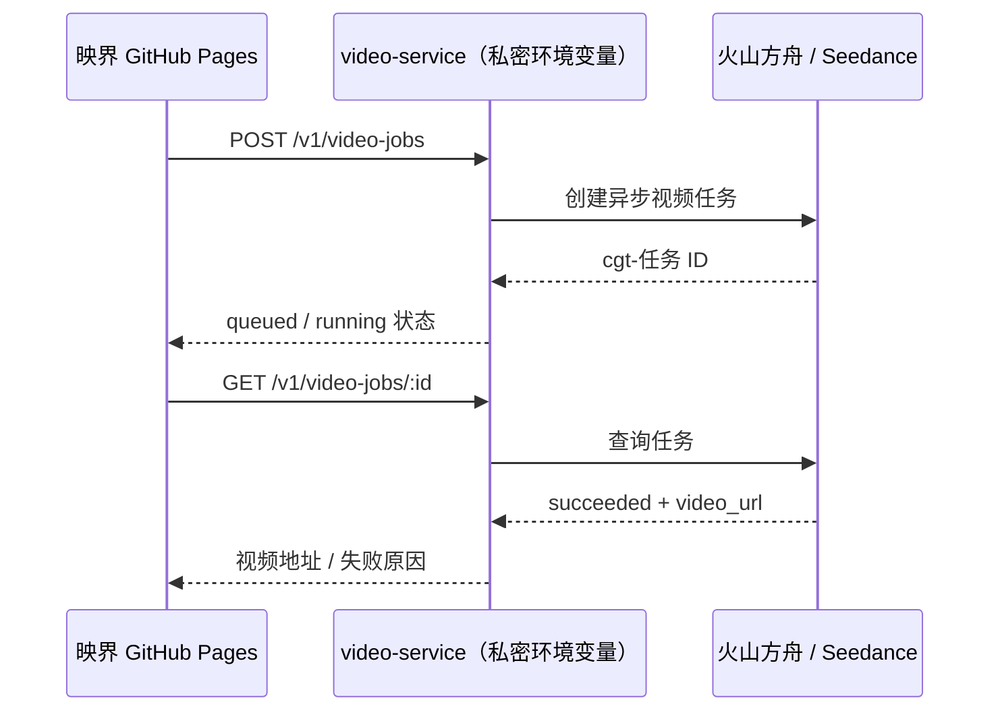

# 方舟文本生成与 Seedance 视频接入指南

映界的网页部署在 GitHub Pages，属于公开静态站点。因此方舟和 Seedance 的 API Key **绝不能**放入 `app.js`、`runtime-config.js`、GitHub Pages 环境变量或任何会被浏览器下载的文件中。本仓库通过 `video-service/` 充当唯一的服务端代理。

创作输入使用 `POST /v1/production/generate` 调用所选方舟文本模型，返回故事分析、角色、场景、分集计划和 8 镜分镜 JSON；返回中的模型 ID、方舟请求 ID 与 Token 用量会写入项目元数据。模型下拉目录来自 `GET /v1/models`，内置豆包、DeepSeek、Kimi、GLM，并允许通过服务端配置加入任意方舟 Model ID / Endpoint ID。未开通的模型只展示能力说明，不能提交请求。

模型是否免费、试用额度和实际单价以方舟账号控制台为准。页面只对有稳定官方价格的模型展示数字单价；第三方与自定义接入点显示“方舟控制台计价”，避免把活动价或 Coding Plan 套餐误写成固定价格。豆包页面列出的 50 万 tokens 属于试用额度，不代表永久免费。[方舟模型列表](https://www.volcengine.com/docs/82379/1330310) · [模型服务计费说明](https://www.volcengine.com/docs/82379/1544681)

> 你已在对话中粘贴过密钥。为降低暴露风险，建议在完成部署后立即在火山方舟控制台轮换该密钥，并只将新密钥保存到部署平台的 Secret/Environment Variables。

## 已接入的生成链路



视频生成走火山方舟的 `POST /api/v3/contents/generations/tasks`，以 `Authorization: Bearer` API Key 鉴权；生成是异步任务，完成后经 `GET /api/v3/contents/generations/tasks/{id}` 查询。Endpoint ID 可以作为请求中的 `model`。火山方舟官方 API Explorer 列出创建、查询、删除和列表四个视频生成任务接口；其短剧最佳实践也使用同一任务地址。[视频生成 API Explorer](https://api.volcengine.com/api-explorer/?action=CreateContentsGenerationsTasks&groupName=%E8%A7%86%E9%A2%91%E7%94%9F%E6%88%90API&serviceCode=ark&version=2024-01-01) · [短剧生产参考](https://developer.volcengine.com/articles/7629571084442861606)

## 服务端配置

`video-service/.env.example` 已写入当前 Endpoint ID。把以下值填入部署平台的 Secret / Environment Variables；本地 `.env` 已被忽略，绝不要提交：

```bash
ARK_API_KEY=<在部署平台 Secret 中填写>
ARK_TEXT_MODEL_TURBO=doubao-seed-2-1-turbo
ARK_TEXT_MODEL_PRO=doubao-seed-2-1-pro
ARK_TEXT_MODEL_EVOLVING=doubao-seed-evolving
ARK_TEXT_MODEL_DEEPSEEK=ep-替换为账号中的接入点
ARK_TEXT_MODEL_KIMI=ep-替换为账号中的接入点
ARK_TEXT_MODEL_GLM=ep-替换为账号中的接入点
ARK_TEXT_MODELS_JSON='[{"id":"my-story-model","providerModel":"ep-替换为接入点","name":"我的故事模型","vendor":"方舟自定义","billing":"account","priceLabel":"方舟控制台计价"}]'
ARK_TEXT_MAX_TOKENS=24000
ARK_VIDEO_ENDPOINT_ID=ep-20260712014412-l4ncj
CORS_ORIGINS=https://zeng-jm123.github.io
PORT=8787
JOB_LIMIT_MAX=3
JOB_LIMIT_WINDOW_SECONDS=300
TRUST_PROXY=false
ALLOW_LOOPBACK_ORIGINS=false
DATABASE_PATH=./data/yingjie.db
```

`CORS_ORIGINS` 必须是网页实际部署地址的**完整 Origin**（协议 + 域名 + 可选端口），例如 `https://zeng-jm123.github.io`；不带路径、不加末尾 `/`。如果有预发布站点，用逗号追加它的 Origin。只有部署平台的反向代理会可靠覆写 `X-Forwarded-For` 时，才把 `TRUST_PROXY` 设为 `true`。

本机调试时可把 `ALLOW_LOOPBACK_ORIGINS=true` 写入私密 `.env`，让 `localhost` / `127.0.0.1` 的任意 HTTP 端口访问网关；公开部署保持 `false`，并只在 `CORS_ORIGINS` 中列出明确的站点 Origin。

本地试运行（仅在本机创建 `video-service/.env`）：

```bash
cd video-service
set -a; source .env; set +a
npm start
```

健康检查：

```bash
curl http://localhost:8787/healthz
```

正常时会返回 `textConfigured` 和 `videoConfigured`。文本生成至少要求 `ARK_API_KEY`，所选第三方或自定义模型还必须配置真实 Model ID / Endpoint ID；视频生成同时要求 `ARK_API_KEY` 和 `ARK_VIDEO_ENDPOINT_ID`。

`ARK_TEXT_MODEL_DEEPSEEK`、`ARK_TEXT_MODEL_KIMI` 和 `ARK_TEXT_MODEL_GLM` 填写的是当前方舟账号真实可调用的 Model ID 或 Endpoint ID，不要照抄展示名称。`ARK_TEXT_MODELS_JSON` 是服务端白名单，数组中每项至少需要 `id`、`providerModel` 和 `name`；还可设置 `vendor`、`description`、`billing`、`priceLabel`、`pricing` 与 `supportsJsonMode`。浏览器只能选择白名单中的模型，不能任意指定高成本模型。

## 发布视频网关

服务没有第三方运行时依赖，但项目数据层使用 Node 内置 SQLite，因此需要 **Node 22.13+**。任意支持 Docker 或 Node 22 的服务都可部署。部署时把 `video-service/` 设为构建目录，使用其中的 Dockerfile，并在部署控制台填写上述环境变量。容器平台的端口变量通常会自动注入；本服务会读取 `PORT`。

服务容器内的默认数据库路径为 `/data/yingjie.db`。部署平台必须把 `/data` 绑定到持久化 Volume（或把 `DATABASE_PATH` 指向平台已挂载的数据盘），否则重启或重新发布容器会导致项目、角色、分镜、制作日志和视频任务记录丢失。

以任意容器平台为例，发布配置应为：

| 项目 | 值 |
| --- | --- |
| 构建上下文 | `video-service/` |
| Dockerfile | `video-service/Dockerfile` |
| 健康检查 | `GET /healthz` |
| 公开端口 | 平台注入的 `PORT`（本地默认 `8787`） |
| 私密变量 | `ARK_API_KEY`、`ARK_VIDEO_ENDPOINT_ID` |
| 模型变量 | `ARK_TEXT_MODEL_*`、`ARK_TEXT_MODELS_JSON`、`ARK_TEXT_MAX_TOKENS` |
| 普通变量 | `CORS_ORIGINS`、`DATABASE_PATH`、`JOB_LIMIT_MAX`、`JOB_LIMIT_WINDOW_SECONDS`、`TRUST_PROXY` |
| 持久化卷 | 挂载到 `/data` |

Docker 本地验证：

```bash
docker build -t yingjie-video-service ./video-service
docker run --rm --env-file video-service/.env -v "$(pwd)/video-service-data:/data" -p 8787:8787 yingjie-video-service
curl http://localhost:8787/healthz
```

部署成功并得到 HTTPS 地址后，先从终端验证再更新网页配置：

```bash
curl https://your-video-gateway.example.com/healthz
```

返回 `configured: true` 后，在根目录的 `runtime-config.js` 写入网关地址：

```js
window.YINGJIE_CONFIG = {
  studioApiBaseUrl: "https://your-video-gateway.example.com",
  videoApiBaseUrl: "https://your-video-gateway.example.com",
  projectId: "yesterday-signal-ep01"
};
```

随后推送 `runtime-config.js` 到 GitHub Pages。前端启动时会读取项目快照，所有 Brief、角色、分镜、制作日志和审片状态的编辑都会自动保存；“使用 Seedance 生成”会创建单镜头任务并记录到对应项目。若仍显示连接失败，依次检查：网页地址是否列在 `CORS_ORIGINS`、网关是否为 HTTPS、`/healthz` 是否返回 `configured: true`。

## 接口合同

### 创建单镜头任务

`POST /v1/video-jobs`

```json
{
  "prompt": "雨夜电台直播间，女主抬头望向闪烁的调音台，电影级冷暖对比，缓慢推进镜头",
  "ratio": "9:16",
  "duration": 5,
  "resolution": "720p",
  "firstFrameUrl": "https://cdn.example.com/shot-01.png",
  "generateAudio": false
}
```

`firstFrameUrl` 和 `lastFrameUrl` 可选；它们必须是可被方舟服务访问的 HTTP(S) 资源。服务会把画幅、时长和分辨率写入受控提示词，同时不会覆盖用户手写的同名参数。默认一律单镜头提交，避免“渲染全部”直接产生大额费用。

### 查询任务

`GET /v1/video-jobs/cgt-...`

```json
{
  "id": "cgt-...",
  "status": "succeeded",
  "videoUrl": "https://...",
  "lastFrameUrl": null,
  "error": null
}
```

## 平台侧安全与运营规则

- 仅对允许的前端域名开放 CORS；生产环境不要保留本地调试来源。
- CORS 不是身份认证，不能阻止他人直接调用公开 URL。本服务加入了按来源 IP 的进程内限流（默认 5 分钟 3 个任务）以避免误触发；多实例生产环境还应接入登录态、预算审批和共享的 Redis/数据库限流，不能只依赖这一层。
- 每次请求限制一个镜头、最大 1500 字符提示词；批量生产应经过队列、预算和人工审批。
- 只在用户确认后提交收费任务。`generateAudio` 默认关闭，且只有兼容的 Endpoint 才应开启。
- 保存任务 ID、镜头/资产版本、模型 Endpoint、用户、成本和审核结论；视频外链有效期和平台实际返回为准，应尽快转存到项目对象存储。
- 对人物参考图先完成肖像授权和内容审核。Seedance 2.0 的官方说明强调肖像与版权授权、以及文本/图片/音频/视频的多模态参考能力。[Seedance 2.0 服务说明](https://developer.volcengine.com/articles/7628567056649125942)
