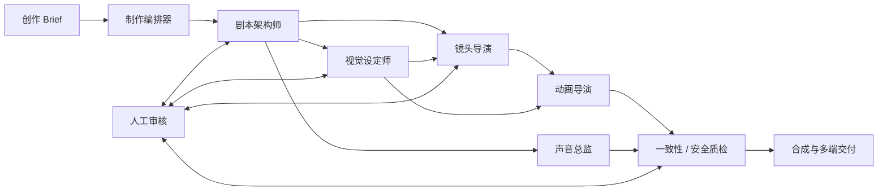
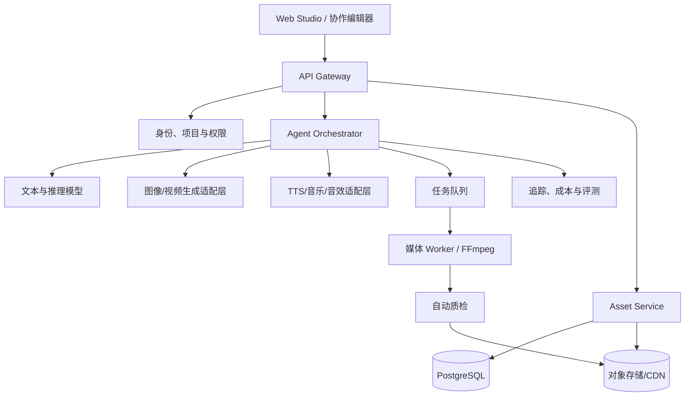

# 映界 AI 短剧制作平台 · 技术方案

## 1. 产品目标与边界

映界是一套以「剧集」为最小生产单元的 AI 原生短剧制作平台。用户输入一个创作 Brief，平台通过多个专职 Agent 协作产出可审阅、可回滚、可继续编辑的剧本、资产、分镜、视频、声音和交付包。

首期聚焦 9:16、2–5 分钟、都市悬疑/情感等强情节短剧。平台不把模型原始输出直接视为成片：每个阶段都需要把结果沉淀为结构化资产，并设置人工审核门。

## 2. 用户与核心体验

| 用户 | 主要任务 | 平台承诺 |
| --- | --- | --- |
| 制片人 | 把控题材、成本和交付节奏 | 一屏看到制作进度、质量、成本与风险 |
| 编剧/导演 | 发展剧情和镜头语言 | 可以针对任意节点局部改写，不破坏全局一致性 |
| 美术/声音 | 锁定角色、世界观、声线 | 资产可版本化、引用可追踪 |
| 后期 | 合成、质检、多平台导出 | 时间轴和素材规格统一，具备可重试的交付任务 |

体验原则：先生成可编辑的「计划」，后生成昂贵媒体；一次修改只重算受影响的下游；每个 Agent 都说明其依据、置信度和待人工确认项。

## 3. 端到端生产链路



### 3.1 Agent 职责

| Agent | 输入 | 结构化输出 | 关键约束 |
| --- | --- | --- | --- |
| 制作编排器 | Brief、规格、预算、资产库 | `ProductionPlan`、依赖图、执行队列 | 只调度，不直接产媒体 |
| 剧本架构师 | Brief、剧集圣经、审核意见 | `EpisodeScript`、人物弧光、节拍表 | 人物动机、伏笔、时长守恒 |
| 视觉设定师 | 剧本、风格板、参考资产 | `CharacterBible`、`SceneBible`、风格 token | 人脸/服装/场景 ID 绑定 |
| 镜头导演 | 节拍表、视觉圣经 | `ShotList`、镜头提示词、运镜、时长 | 每句台词映射到镜头和情绪 |
| 动画导演 | 锁定镜头、参考帧、动作库 | `MotionJob`、参考视频、运动参数 | 角色、镜头、动作的可控性 |
| 声音总监 | 台词、角色声线、情绪曲线 | `VoicePlan`、TTS 任务、BGM/SFX 轨 | 仅使用授权音色，响度统一 |
| 质检 Agent | 所有候选资产与规则 | `QualityReport`、阻断/重试建议 | 一致性、内容安全、技术规格、版权 |

### 3.2 编排机制

采用「有向无环工作流 + 事件驱动任务」：编排器把每一步写为可恢复的 `Job`，任务完成后发出事件，由满足依赖的下游任务消费。长时视频生成由异步队列处理，前端用 Server-Sent Events 或 WebSocket 订阅状态。

修改传播遵循资产版本图：例如改角色服装，只使引用该角色的参考帧、镜头视频和相关海报失效；不重跑剧本和无关镜头。每次运行带 `run_id`、输入哈希和模型版本，从而支持缓存、重试和审计。

## 4. 系统架构



### 前端

- React/Next.js 或 Vue/Nuxt 实现工作台；Canvas/DOM 负责分镜，视频时间轴使用可虚拟化列表。
- 采用乐观编辑 + 版本快照：脚本、提示词、镜头参数均支持 diff、评论、审批和一键回滚。
- 接收 `job.updated`、`asset.ready`、`quality.failed` 事件，队列状态不依赖轮询。

### 后端

- API：BFF 层提供项目、资产、审阅、导出接口；采用 REST + SSE，复杂协作可补 GraphQL。
- Orchestrator：推荐 Temporal、Inngest 或自建 durable workflow，负责挂起、超时、幂等、重试、人工审批 gate。
- 适配层：将各模型供应商统一封装为 `generateText`、`generateImage`、`generateVideo`、`synthesizeVoice`，隔离模型切换和供应商回调差异。
- Worker：GPU 任务与 CPU 合成任务分池；视频拼接、字幕、响度、转码使用容器化 FFmpeg Worker。

### 数据层

- PostgreSQL：项目、版本、任务、权限、审阅、成本账本。
- S3/OSS：原始媒体、派生媒体、代理文件；通过 CDN 分发和短期签名 URL 访问。
- Redis/Kafka：速率限制、任务分发、事件流和热点缓存。
- 向量索引（可选）：剧集圣经、已审核资产、品牌规则的检索增强。

## 5. 关键数据合同

```ts
type AssetRef = { id: string; version: number; kind: 'script'|'character'|'scene'|'image'|'video'|'audio'; uri: string }

type Shot = {
  id: string; sequence: number; durationMs: number; scriptBeatId: string
  framing: 'ECU'|'CU'|'MS'|'WS'; cameraMove: string; mood: string
  characterRefs: AssetRef[]; sceneRef: AssetRef; prompt: string
  referenceImage?: AssetRef; status: 'draft'|'approved'|'rendering'|'ready'|'rejected'
}

type ProductionJob = {
  id: string; projectId: string; runId: string; type: string
  inputRefs: AssetRef[]; dependencyIds: string[]; model: string
  status: 'queued'|'running'|'waiting_review'|'succeeded'|'failed'|'cancelled'
  idempotencyKey: string; costCents?: number; outputRefs: AssetRef[]
}
```

原则：提示词不是孤立字符串。它必须指向具体的角色、场景、镜头和风格版本；生成结果也必须记录源资产、模型、参数、种子、审核状态和版权元数据。

## 6. 核心 API（示例）

| 方法 | 路径 | 用途 |
| --- | --- | --- |
| `POST` | `/v1/projects` | 创建剧集项目并写入规格 |
| `POST` | `/v1/episodes/{id}/runs` | 根据 Brief 创建制作运行 |
| `GET` | `/v1/runs/{id}/events` | SSE 订阅 Agent、任务和审核事件 |
| `PATCH` | `/v1/shots/{id}` | 局部修改镜头参数并触发失效分析 |
| `POST` | `/v1/assets/{id}/approve` | 锁定资产版本，供下游消费 |
| `POST` | `/v1/exports` | 创建平台规格、字幕与水印配置的交付任务 |

所有写接口要求 `Idempotency-Key`；模型回调通过签名验证并按 `job_id` 去重。媒体下载只返回带作用域和过期时间的签名 URL。

## 7. 一致性与质量控制

1. **资产锁定**：角色脸型、发型、服装、声音、场景风格均有不可变版本。下游任务只能引用已批准版本。
2. **生成前检查**：镜头提示词自动注入角色/场景 token、禁用词、画幅、时长、镜头语言。
3. **生成后检查**：人脸相似度、服装/场景 CLIP 相似度、口型同步、帧率、黑帧、响度、字幕覆盖、内容安全。
4. **叙事检查**：LLM 评审台词归属、因果链、人物已知信息、镜头与剧本覆盖率；低置信结果必须进人工队列。
5. **发布检查**：授权、合成标识、水印、未成年人/肖像/敏感内容策略、平台规范。

质量分数只做排序和预警，不能替代审核。每条自动拒绝均应给出规则、证据和可执行的重试建议。

## 8. 安全、版权与成本

- 秘钥只保存在服务端密钥管理系统，浏览器永不直连模型供应商。
- 项目采用组织/项目/角色三级 RBAC；源素材和成片以项目为访问边界。
- 用户上传与生成媒体均做恶意文件、敏感内容和版权风险扫描；建立删除、导出、保留期限和审计日志能力。
- 语音克隆采用显式同意、可撤销授权、音色用途范围和水印策略；禁止仿冒未授权公众人物。
- 每个 Job 预估 credits 与金额，超预算时由制片人批准。用输入哈希缓存文本、图像和代理文件，视频任务做并发限额与失败上限。

## 9. 可观测性与评测

每个运行记录：任务耗时、排队时间、模型和参数、输入/输出版本、GPU/供应商错误、成本、重试、人工接受率。使用 OpenTelemetry 串联一次制作运行的所有 Agent span。

建立固定评测集：人物一致性、镜头可执行性、台词可懂度、节奏匹配、敏感内容漏检、平均成本和从 Brief 到粗剪的用时。灰度切换模型前，必须在同一评测集上比较质量、成本与失败率。

## 10. 实施路线

| 阶段 | 目标 | 关键交付 |
| --- | --- | --- |
| P0（2 周） | 验证创作工作流 | Brief、剧本、角色/场景、分镜编辑与人工审批 |
| P1（3–4 周） | 打通媒体链路 | 图像/视频/TTS 适配器、异步队列、资产版本与预览 |
| P2（2–3 周） | 可生产交付 | 合成、字幕、质检、成本面板、平台导出 |
| P3（持续） | 规模化协作 | 多人协作、评测、模板市场、品牌资产与权限治理 |

P0 的验收指标：从 Brief 到可审剧本少于 5 分钟；单集分镜完成率 90% 以上；所有资产均有来源与版本。P1/P2 再把“能编辑”推进为“能稳定交付”。

## 11. 本仓库原型与生产版的关系

本仓库保留 GitHub Pages 的产品体验，同时已提供可部署的项目服务：角色、分镜、Brief、标签、制作日志、审片/交付状态和视频任务元数据会写入 SQLite，并通过项目快照与 `revision` 乐观锁恢复。数据库文件必须挂载到持久化 Volume；接口和部署配置见 [Seedance 接入指南](./Seedance接入指南.md)。

该实现适用于单实例的创作工作台持久化。进入多人和高并发生产阶段时，应将 SQLite 迁移到上述 PostgreSQL 方案，补充身份认证、项目级 RBAC、对象存储、共享限流与任务队列；不要把供应商 SDK、模型密钥或长任务调度直接放进浏览器。
