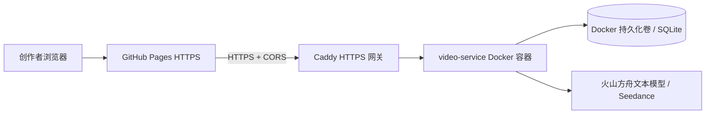

# 火山引擎生产部署（GitHub Pages + 方舟 + Seedance）

生产结构如下。GitHub Pages 仅托管静态网页；API Key、SQLite 数据库和 Seedance 请求始终留在火山引擎 ECS 内。



选择 ECS 而非 VKE：当前只有一个小型 Node 服务和一个 SQLite 数据库。ECS + Docker 数据盘更省钱、可直接持久化，也不引入 Kubernetes、负载均衡和集群的额外运维成本。服务实际调用视频生成在火山方舟侧完成，ECS 不需要 GPU。

## 部署前置条件

1. 火山引擎账号已完成实名认证并有可用余额。
2. 一个可管理 DNS 的域名，例如 `api.example.com`。GitHub Pages 是 HTTPS，浏览器不会允许它调用 `http://公网 IP`；网关必须具有自己的 HTTPS 域名。
3. GitHub Pages 已发布到 `https://zeng-jm123.github.io/yingjie-ai-drama-studio/`。

## 一次性创建云资源

在火山引擎控制台的华北 2（北京）创建：

| 资源 | 建议配置 | 用途 |
| --- | --- | --- |
| ECS | Ubuntu 24.04、2 vCPU / 4 GiB、40 GiB 云盘 | 运行 Docker 与 Caddy |
| 弹性公网 IP | 绑定到该 ECS | 为 API 提供稳定公网入口 |
| 安全组 | 入站仅开放 TCP `80`、`443`、`22`（SSH 仅限你的 IP） | HTTPS 与运维 |

不要对公网开放 `8787`，它仅在 Docker 内网中被 Caddy 访问。

为 API 创建 `A` 记录，例如 `api.example.com -> ECS 弹性公网 IP`。等 DNS 生效后，Caddy 会自动向 Let's Encrypt 申请和续期证书。

## 在 ECS 上发布服务

登录 ECS 后执行：

```bash
curl -fsSL https://raw.githubusercontent.com/Zeng-JM123/yingjie-ai-drama-studio/main/video-service/deploy/volcengine/bootstrap-ubuntu.sh -o /tmp/yingjie-bootstrap.sh
bash /tmp/yingjie-bootstrap.sh

cd /opt/yingjie-ai-drama-studio/video-service/deploy/volcengine
cp .env.example .env
chmod 600 .env
```

编辑只保存在 ECS 上的 `.env`，填写：

```bash
GATEWAY_DOMAIN=api.example.com
ACME_EMAIL=你的运维邮箱
ARK_API_KEY=新的方舟密钥
ARK_TEXT_MODEL_TURBO=doubao-seed-2-1-turbo
ARK_TEXT_MODEL_PRO=doubao-seed-2-1-pro
ARK_TEXT_MODEL_EVOLVING=doubao-seed-evolving
ARK_TEXT_MODEL_DEEPSEEK=ep-替换为账号中的接入点
ARK_TEXT_MODEL_KIMI=ep-替换为账号中的接入点
ARK_TEXT_MODEL_GLM=ep-替换为账号中的接入点
ARK_TEXT_MODELS_JSON=[]
ARK_TEXT_MAX_TOKENS=24000
ARK_VIDEO_ENDPOINT_ID=ep-20260712014412-l4ncj
STUDIO_ACCESS_TOKEN=使用openssl_rand生成的长随机值
CORS_ORIGINS=https://zeng-jm123.github.io
```

然后启动并验证：

```bash
docker compose up -d --build
docker compose ps
curl https://api.example.com/healthz
```

健康检查必须返回 `ok: true` 和 `configured: true`。若证书签发失败，先确认域名 A 记录已指向此 ECS，且安全组放行 80/443。

`STUDIO_ACCESS_TOKEN` 不是 Ark 密钥，但同样必须保密：它用于阻止他人绕过网页直接调用付费生成接口。首次打开云端工作室时浏览器会提示输入该值，并仅保存在当前浏览器本机。可在 ECS 上用 `openssl rand -hex 32` 生成，绝不能写入 GitHub Pages 的 `runtime-config.js`。

## 切换 GitHub Pages 到生产网关

网关验证通过后，把根目录 `runtime-config.js` 中的两个地址都改为实际 HTTPS 地址：

```js
studioApiBaseUrl: "https://api.example.com",
videoApiBaseUrl: "https://api.example.com",
```

将改动推送到 `main`。项目已配置 GitHub Actions 发布 Pages；页面更新后强制刷新一次即可。浏览器中的“已保存”表示项目数据落到了 ECS 持久化卷；点击“使用 Seedance 生成”才会创建一个收费的视频任务。

## 后续更新与回滚

更新服务：

```bash
cd /opt/yingjie-ai-drama-studio
git pull --ff-only origin main
cd video-service/deploy/volcengine
docker compose up -d --build
```

备份数据库：

```bash
docker compose exec -T gateway sh -c 'cp /data/yingjie.db /data/yingjie-backup.db'
```

生产密钥只保存在 ECS 的 `.env`。此前在对话中粘贴过的方舟密钥应在完成迁移后立即轮换；不能提交到 Git、GitHub Pages 或 `runtime-config.js`。
